# 👩‍💻 CS50AI — Introduction to Artificial Intelligence with Python

> This course explores the concepts and algorithms at the foundation of modern artificial intelligence, diving into the ideas that give rise to technologies like game-playing engines, handwriting recognition, and machine translation. Through hands-on projects, students gain exposure to the theory behind graph search algorithms, classification, optimization, machine learning, large language models, and other topics in artificial intelligence as they incorporate them into their own Python programs.

- Course: CS50’s Introduction to Artificial Intelligence with Python  
- Official course page: https://cs50.harvard.edu/ai/2020/  
- Completed: **October 2023**

> Academic honesty: if you are currently taking CS50AI, do not submit these solutions as your own.

---

## Contents

- [Week 0 — Search](#week-0--search)
- [Week 1 — Knowledge](#week-1--knowledge)
- [Week 2 — Uncertainty](#week-2--uncertainty)
- [Week 3 — Optimization](#week-3--optimization)
- [Week 4 — Learning](#week-4--learning)
- [Week 5 — Neural Networks](#week-5--neural-networks)
- [Week 6 — Language](#week-6--language)

---

## Week 0 — Search
Week page: https://cs50.harvard.edu/ai/weeks/0/

**Topics covered:** Search problems, depth-first search (DFS), breadth-first search (BFS), greedy best-first search, A* search, minimax, alpha-beta pruning.

### Project 0A — Degrees
Write a program determining how many “degrees of separation” apart two actors are.

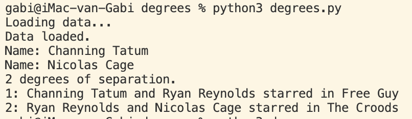

### Project 0B — Tic-Tac-Toe
Implement an AI to play Tic-Tac-Toe optimally (minimax).

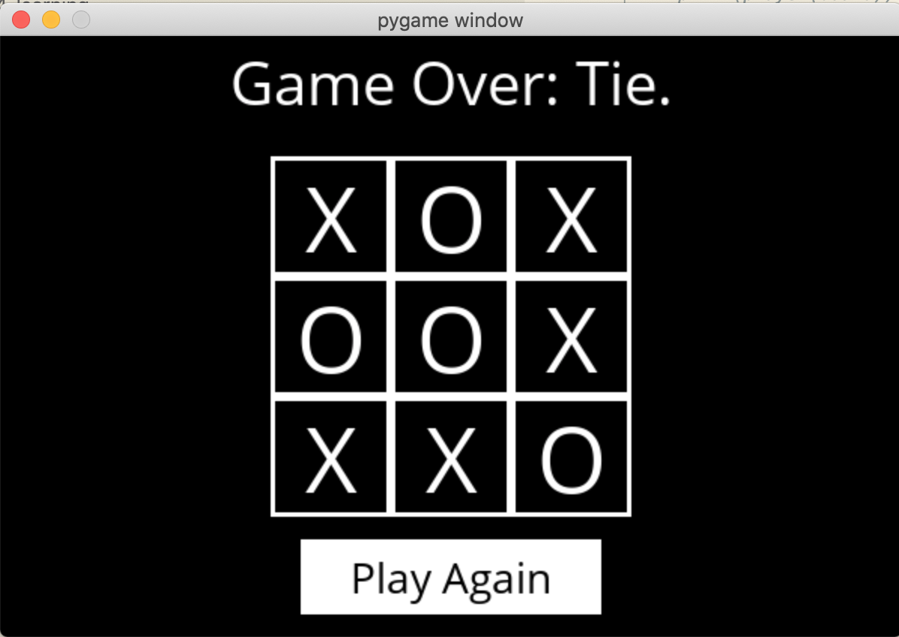

---

## Week 1 — Knowledge
Week page: https://cs50.harvard.edu/ai/weeks/1/

**Topics covered:** Propositional logic, entailment, inference, model checking, resolution, first-order logic.

### Project 1A — Knights
Write a program to solve logic puzzles.

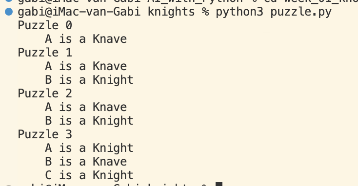

### Project 1B — Minesweeper
Write an AI to play Minesweeper (knowledge representation).

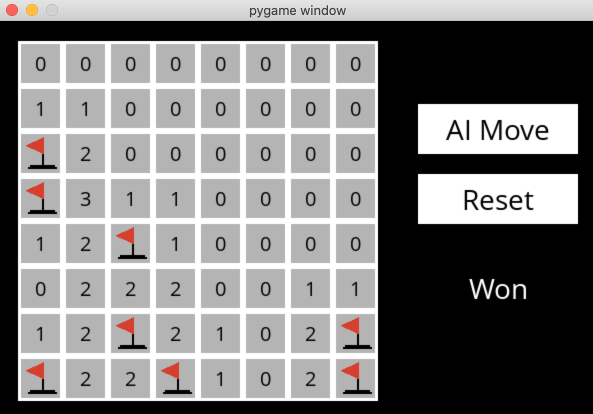

---

## Week 2 — Uncertainty
Week page: https://cs50.harvard.edu/ai/weeks/2/

**Topics covered:** Probability, conditional probability, random variables, independence, Bayes’ rule, joint probability, Bayesian networks, sampling, Markov models, hidden Markov models.

### Project 2A — PageRank
Write an AI to rank web pages by importance (Markov chain).

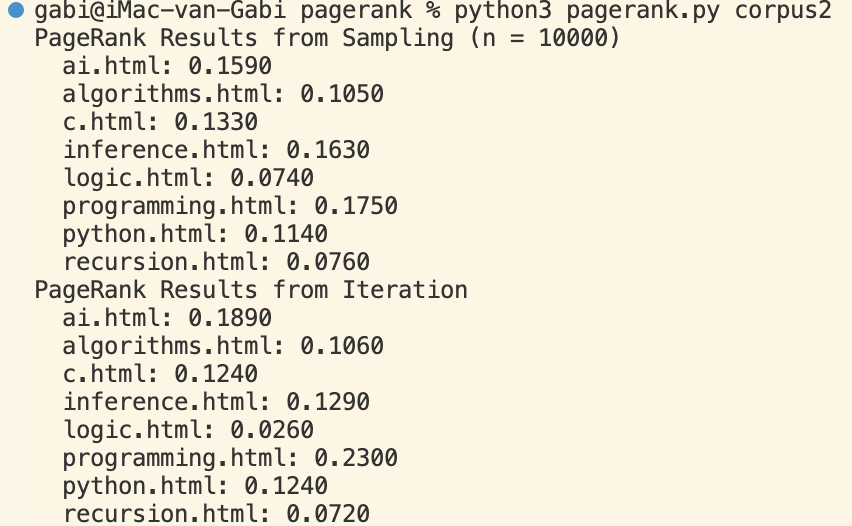

### Project 2B — Heredity
Write an AI to assess the likelihood of a person having a particular genetic trait (Bayesian network).

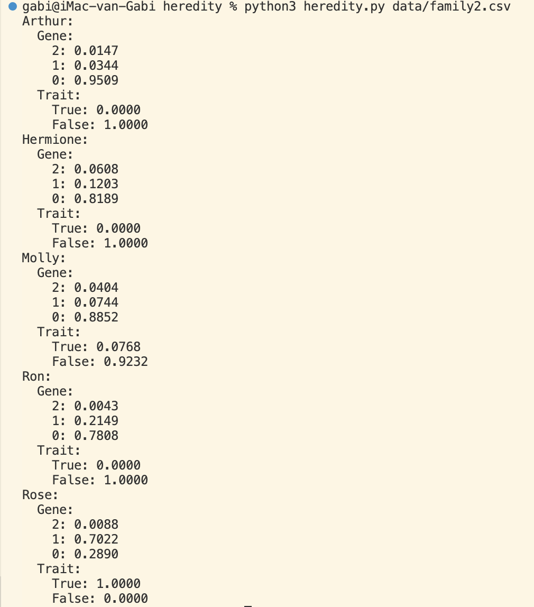

---

## Week 3 — Optimization
Week page: https://cs50.harvard.edu/ai/weeks/3/

**Topics covered:** Local search, hill climbing, simulated annealing, linear programming, constraint satisfaction, backtracking search.

### Project 3 — Crossword
Write an AI to generate crossword puzzles (constraint satisfaction + backtracking).

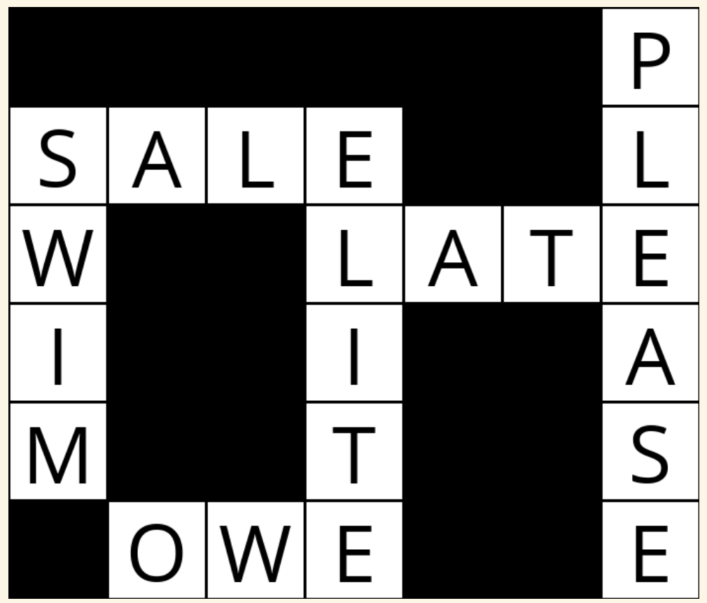

---

## Week 4 — Learning
Week page: https://cs50.harvard.edu/ai/weeks/4/

**Topics covered:** Supervised learning (k-NN, perceptron, SVM, regression), loss functions, overfitting + regularization, reinforcement learning (MDPs, Q-learning), unsupervised learning (k-means).

**Libraries used:** scikit-learn

### Project 4A — Shopping
Predict whether online shopping customers will complete a purchase (k-nearest neighbors classifier).

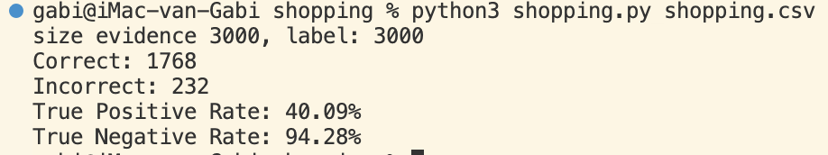

### Project 4B — Nim
Teach an AI to play Nim through reinforcement learning.

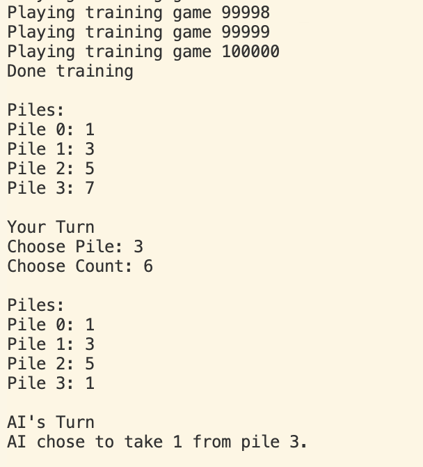

---

## Week 5 — Neural Networks
Week page: https://cs50.harvard.edu/ai/weeks/5/

**Topics covered:** Artificial neural networks, activation functions, gradient descent, backpropagation, overfitting, TensorFlow, image convolution, CNNs, RNNs.

**Libraries used:** TensorFlow, Matplotlib

### Project 5 — Traffic
Identify which traffic sign appears in a photograph (CNN with TensorFlow).

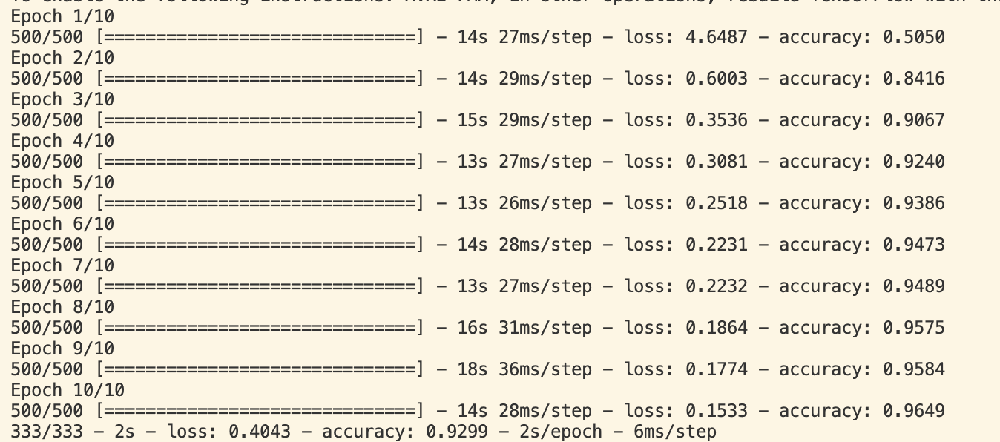

---

## Week 6 — Language
Week page: https://cs50.harvard.edu/ai/weeks/6/

**Topics covered:** Syntax, semantics, context-free grammar, NLTK, n-grams, bag-of-words, naive Bayes, word representations (word2vec), attention, transformers.

**Libraries used:** NLTK

### Project 6A — Parser
Parse sentences and extract noun phrases.

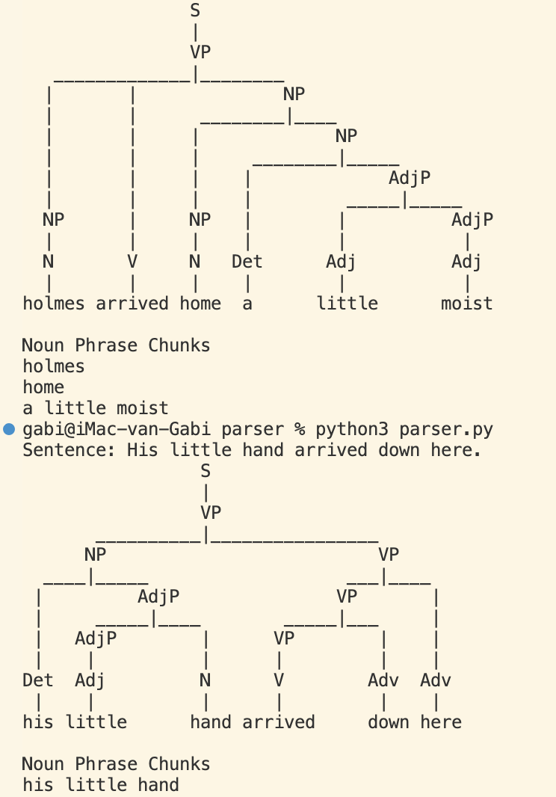

### Project 6B — Questions
Answer questions using information retrieval over a corpus.

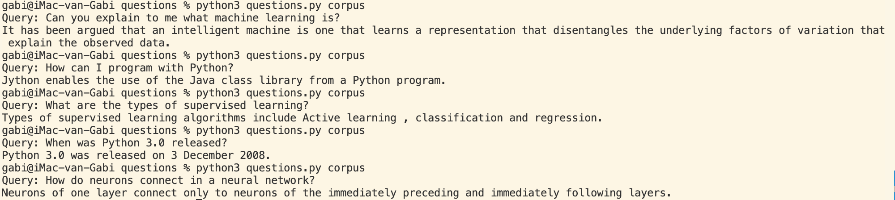