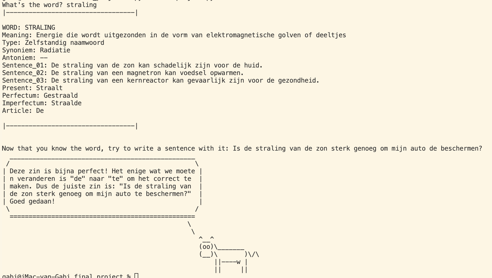

# 👩‍💻 [ CS50P ] PYTHON
https://cs50.harvard.edu/python/2022/
(Completed in July 2023)

**FINAL PROJECT:** [Dutchionary](https://www.youtube.com/watch?v=rKdzWVigkXU&y) is a Flask web application powered by OpenAI API.
I submitted a simple application running in the terminal for the final assignment.

