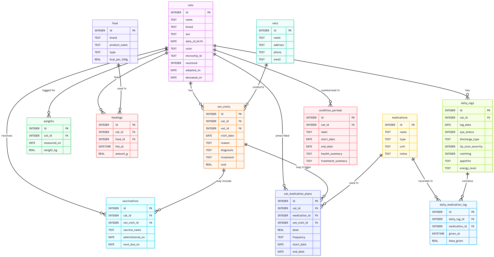
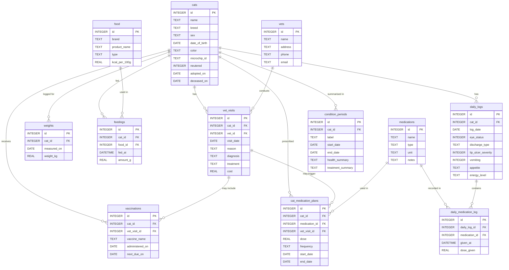

# Design Document — Cat Health Tracker 😺

- By *Gabriella Fonseca* 
- Video overview: <URL HERE>

---

## Scope

### Purpose

This database tracks everything relevant to the health and daily care of one or more pet cats. It serves as a single structured source of truth for a cat owner — covering identity records, veterinary history, vaccinations, medication catalogues and prescribed plans, day-by-day symptom and wellness logs, feeding history, and narrative summaries of health phases over time.

The database was designed with a specific real-world case in mind: a cat named Milo who has a chronic eye condition (FHV-1 keratoconjunctivitis) requiring long-term, evolving treatment. This drove the need for a granular daily log with structured symptom scores and a flexible medication system that can track not just what a cat is prescribed, but exactly what was administered on each occasion, including dose and time.

### In Scope

- **Cats** — each individual cat in the household, with biographical and identity data.
- **Veterinarians and clinics** — practices and individual practitioners providing care.
- **Vet visits** — appointments with findings, diagnosis, treatment, and cost.
- **Vaccinations** — each vaccine administered, with booster due dates.
- **Weights** — periodic measurements for trend monitoring.
- **Food products** — a catalogue of food brands and types.
- **Feedings** — a timestamped log of what each cat ate and how much.
- **Medications** — a catalogue of medications (what they are, their unit of measure).
- **Cat medication plans** — prescribed courses per cat, capturing intended dose and frequency over a period.
- **Daily logs** — day-by-day symptom and wellness observations per cat.
- **Daily medication log** — individual administration events per day, with timestamp and actual dose.
- **Condition periods** — narrative summaries of distinct health phases, useful for communicating with vets.

### Out of Scope

- **Multi-user access or household management** — ownership sharing, user accounts, and access control are not modelled.
- **Financial tracking beyond vet visit costs** — food spend, insurance, and general pet expenses are excluded.
- **Litter, breeding, or pedigree records** — reproductive history is not tracked.
- **Real-time location or GPS tracking** — roaming or outdoor activity is not stored.
- **Medication stock/inventory management** — how much of a medication remains is not tracked.
- **Automated reminders or notifications** — the database stores the data; an application layer would handle alerting.

---

## Functional Requirements

### What a user can do

1. **Manage cat profiles** — register cats with biographical details; update data over time; record adoption and, if relevant, death.
2. **Track veterinary history** — log each visit with its reason, findings, and treatment; link visits to clinics and practitioners.
3. **Manage vaccinations** — record vaccines administered and their booster due dates; query what is upcoming or overdue.
4. **Maintain a medication catalogue** — define medications once with their type and unit of measure, to be referenced consistently across plans and logs.
5. **Record and track medication plans** — capture what a vet prescribes for a cat during a given period, including dose and frequency.
6. **Log daily health observations** — record structured symptom scores (eye status, lip ulcer severity, vomiting) alongside free-text notes each day.
7. **Log individual medication administrations** — record every time a medication is given, with the exact dose and timestamp.
8. **Monitor weight trends** — log periodic measurements and query the trend per cat.
9. **Log feedings** — record meals with food product and gram amount; compute approximate calorie intake where data is available.
10. **Summarise health phases** — record narrative condition periods for review with vets or for personal reference.
11. **Use pre-built views** for common queries:
    - `upcoming_vaccinations` — boosters due within 60 days.
    - `active_medication_plans` — current prescriptions per cat.
    - `latest_weights` — most recent weight per cat.
    - `eye_status_7day_avg` — 7-day rolling average eye score per cat.
    - `daily_medication_summary` — what each cat received each day.
    - `current_condition` — most recent condition period per cat.
    - `flare_up_days` — all days where eye status was 3 or above.

### What is beyond scope

- The database does not send reminders, trigger alerts, or perform automated analysis.
- It does not flag abnormal values (e.g., sudden weight drop) automatically.
- It does not support binary file attachments such as X-ray images or lab PDFs — only file paths can be stored as text (in the future, not implemented in current version).
- It does not enforce medication compliance or verify that planned doses were actually administered.

---

## Representation

- 🧜‍♀️ The database overview can also be acessed at [Mermaid.AI](https://mermaid.ai/d/24e2e9b6-62c8-4396-9547-be23fd2a0560) for a better experience.

### Entities

#### `cats`

The central entity. Every other health or care record references a cat by `cat_id`.

| Column | Type | Constraints | Rationale |
|---|---|---|---|
| `id` | INTEGER | PRIMARY KEY | Stable surrogate key. |
| `name` | TEXT | NOT NULL | Every cat must have a name. |
| `breed` | TEXT | — | Nullable; many cats are of unknown or mixed breed. |
| `sex` | TEXT | NOT NULL, CHECK IN ('M','F') | Single-character codes enforce a controlled vocabulary. |
| `date_of_birth` | DATE | — | Nullable; rescue cats often have estimated DOBs. |
| `color` | TEXT | — | Free text for flexibility. |
| `microchip_id` | TEXT | UNIQUE | Stored as TEXT to preserve leading zeros and allow NULL. UNIQUE prevents duplicates. |
| `neutered` | INTEGER | NOT NULL DEFAULT 0, CHECK IN (0,1) | Boolean as integer, idiomatic in SQLite. |
| `notes` | TEXT | — | Free text for personality notes, quirks, etc. |
| `adopted_on` | DATE | — | Household join date. |
| `deceased_on` | DATE | — | NULL while alive; non-NULL marks the cat as deceased. |

#### `vets`

Clinics and practitioners. Separated from visits so contact details are updated in one place.

| Column | Type | Rationale |
|---|---|---|
| `name` | TEXT NOT NULL | Clinic or practitioner name. |
| `address`, `phone`, `email`, `website` | TEXT | Optional; real-world data is often incomplete. |
| `notes` | TEXT | E.g., "24-hour emergency available". |

#### `vet_visits`

One row per appointment per cat. Links a cat to a vet and records what happened.

| Column | Type | Rationale |
|---|---|---|
| `visit_date` | DATE NOT NULL | Core date. |
| `reason` | TEXT NOT NULL | Always known at the time of entry. |
| `diagnosis`, `treatment` | TEXT | Nullable; may not apply or may be entered retrospectively. |
| `follow_up_due` | DATE | NULL if no follow-up needed. |
| `cost` | REAL | REAL supports decimal amounts; NULL if unknown. |

#### `vaccinations`

Each vaccine administered, including booster scheduling.

| Column | Type | Rationale |
|---|---|---|
| `vet_visit_id` | INTEGER, nullable FK | Some vaccinations are entered retrospectively without a linked visit. |
| `vaccine_name` | TEXT NOT NULL | Free text to accommodate regional naming. |
| `next_due_on` | DATE | NULL for one-time vaccines or unknown schedules. |
| `batch_number` | TEXT | Traceability for pharmaceutical recalls. |

#### `weights`

A time series of weight measurements per cat.

| Column | Type | Rationale |
|---|---|---|
| `weight_kg` | REAL NOT NULL, CHECK > 0 | Kilograms is the veterinary standard. CHECK prevents zeroes/negatives. |
| `measured_by` | TEXT | "owner" vs "vet" may affect interpretation. |

#### `food`

A product catalogue for feeding logs. Normalising food avoids repeating brand/calorie data on every row.

| Column | Type | Rationale |
|---|---|---|
| `type` | TEXT NOT NULL, CHECK IN (...) | Constrained vocabulary (dry, wet, raw, treat, supplement, other) for filtering. |
| `kcal_per_100g` | REAL | Nullable; many treats do not publish calorie data. |

#### `feedings`

A timestamped log of individual meals.

| Column | Type | Rationale |
|---|---|---|
| `fed_at` | DATETIME NOT NULL | Full timestamp to distinguish multiple meals per day. |
| `amount_g` | REAL NOT NULL, CHECK > 0 | Grams as a universal unit for dry and wet food. |
| `fed_by` | TEXT | Useful in multi-person households or when a sitter feeds the cat. |

#### `medications`

A catalogue of medications. Stores what a medication **is** — not how it is prescribed or administered. This separation avoids duplicating drug metadata across every prescription.

| Column | Type | Rationale |
|---|---|---|
| `name` | TEXT NOT NULL | Drug or product name. |
| `type` | TEXT NOT NULL, CHECK IN (...) | Controlled vocabulary: steroid, antibiotic, antiviral, antifungal, antiparasitic, lubricant, supplement, immunosuppressant, analgesic, other. |
| `unit` | TEXT NOT NULL | The base unit for all dose values referencing this medication (e.g., "mg", "ml", "drop"). Centralising the unit here ensures all doses across plans and logs are consistently interpreted. |
| `notes` | TEXT | E.g., brand information, tablet strength, tolerability notes. |

#### `cat_medication_plans`

A prescribed course of a medication for a specific cat over a period. Captures the **intended** dose and frequency, as decided by a vet or the owner. Actual administration is recorded separately.

| Column | Type | Rationale |
|---|---|---|
| `vet_visit_id` | INTEGER, nullable FK | Not every plan originates from a tracked visit. |
| `dose` | REAL | Intended dose in the medication's unit. Nullable to allow plans that only record frequency. |
| `frequency` | TEXT | Plain English (e.g., "once daily", "every other day") is more readable than a numeric interval. |
| `start_date` | DATE NOT NULL | Required to determine duration. |
| `end_date` | DATE | NULL = ongoing or indefinite. |
| `reason` | TEXT | Clinical justification for the prescription. |

#### `daily_logs`

One row per cat per day. Captures structured symptom scores and free-text observations. A UNIQUE constraint on `(cat_id, log_date)` enforces one entry per cat per day.

| Column | Type | Rationale |
|---|---|---|
| `eye_status` | INTEGER, CHECK 0–5 | Numeric scale (0 = healthy, 5 = severe) enables trend analysis. |
| `discharge_type` | TEXT, CHECK IN (...) | Controlled vocabulary: Watery, Mucous, Gelatinous, None. |
| `lip_ulcer_severity` | INTEGER, CHECK 0–3 | Numeric scale for ulcer severity. |
| `vomiting` | INTEGER, CHECK IN (0,1) | Boolean. |
| `appetite`, `energy_level` | TEXT, CHECK IN (...) | Controlled vocabulary: Normal, Reduced, Increased. |
| `potential_triggers`, `general_notes` | TEXT | Free text for qualitative context. |

#### `daily_medication_log`

Records each individual administration of a medication on a given day. The `given_at` timestamp allows AM vs. PM to be deduced from the time component.

| Column | Type | Rationale |
|---|---|---|
| `daily_log_id` | INTEGER NOT NULL, FK | Links to the daily log entry for that day. |
| `medication_id` | INTEGER NOT NULL, FK | Links to the medication catalogue; provides the unit for `dose_given`. |
| `given_at` | DATETIME NOT NULL | Full timestamp. AM administrations are recorded at 08:00, PM at 20:00. |
| `dose_given` | REAL NOT NULL, CHECK > 0 | Actual dose in the unit defined on the `medications` record. Allows for doses that differ from the plan (e.g., half a tablet). |

#### `condition_periods`

Narrative summaries of a cat's health status over a defined period. Mirrors the "Period Summary" sheet in Milo's log. Intended for communication with vets and personal reference.

| Column | Type | Rationale |
|---|---|---|
| `label` | TEXT | Human-readable period name, e.g. "Nov 2024 – Jun 2025". |
| `start_date`, `end_date` | DATE | `end_date` NULL means the period is ongoing. |
| `health_summary` | TEXT | Combined eye, systemic, and behavioural observations for the period. |
| `treatment_summary` | TEXT | What medications and interventions were active during this period. |
| `notes` | TEXT | Additional context. |

---

### Relationships

The entity relationship diagram below is written in Mermaid.js syntax and can be rendered at [mermaid.live](https://mermaid.ai/d/24e2e9b6-62c8-4396-9547-be23fd2a0560).

**Key relationships summarised:**

- `cats` is the hub. All health, care, and observation records point back to it.
- `vet_visits` joins `cats` and `vets` in a many-to-one relationship with each.
- `vaccinations` and `cat_medication_plans` optionally link to a `vet_visit` — not every entry comes from a tracked appointment.
- `medications` is a shared catalogue; both `cat_medication_plans` and `daily_medication_log` reference it, keeping drug metadata in one place.
- `daily_logs` is the parent of `daily_medication_log` — each day's symptom record can have zero or more medication administration events.
- `food` is a catalogue referenced by `feedings`, preventing repeated brand and calorie data.

---

## Optimizations

### Indexes

**`cat_id` foreign key indexes** were created on every child table (`vet_visits`, `vaccinations`, `weights`, `feedings`, `cat_medication_plans`, `daily_logs`, `condition_periods`). The most common query pattern in this database is filtering by cat (e.g., *"show me Milo's records"*), so without these indexes every such query would require a full table scan.

**Date indexes** on `vet_visits.visit_date`, `daily_logs.log_date`, `daily_medication_log.given_at`, and `weights.measured_on` support the second most common query pattern: date-range filters (e.g., "all logs in the last 30 days", "visits this year").

**`vaccinations.next_due_on`** is indexed to make booster reminder queries fast — this is the central filter in the `upcoming_vaccinations` view.

**`cat_medication_plans.end_date`** is indexed to efficiently find currently active plans (`WHERE end_date IS NULL OR end_date >= DATE('now')`).

**`medications.name` and `medications.type`** are indexed to support catalogue lookups (e.g., "find all lubricants") without full scans.

### Views

**`upcoming_vaccinations`** — returns boosters due within the next 60 days with a computed `days_until_due` column. Avoids the need to write a multi-table join and date arithmetic every time.

**`active_medication_plans`** — surfaces all ongoing prescriptions per cat. Eliminates the need to remember the `IS NULL OR end_date >= now` pattern.

**`latest_weights`** — uses a correlated subquery to return the single most recent weight per cat. Useful as a dashboard snapshot.

**`eye_status_7day_avg`** — aggregates the daily log to produce a rolling 7-day average eye status score per cat. Particularly valuable for monitoring chronic conditions like Milo's.

**`daily_medication_summary`** — joins `daily_medication_log`, `daily_logs`, `cats`, and `medications` to produce a human-readable per-day per-cat summary of what was given. Uses `GROUP_CONCAT` on `TIME(given_at)` to show all administration times in a single row.

**`current_condition`** — returns the most recent condition period per cat using a correlated subquery on `start_date`. One-line snapshot of where each cat currently stands.

**`flare_up_days`** — filters `daily_logs` for days where `eye_status >= 3`. Provides a quick index of all problematic days without any parameters needed.

---

## Limitations

### Design limitations

- **Single currency**: The `cost` column on `vet_visits` stores a numeric value with no currency code. Meaningful only in a single-currency context.
- **Approximate timestamps for medication**: AM administrations are stored at 08:00 and PM at 20:00 by convention, not always recorded to the exact minute. The time component is indicative rather than precise.
- **Free-text frequency**: Medication plan frequency (e.g., "every other day") is stored as plain text. It is not machine-readable for automated compliance checking or scheduling.
- **No feeding schedule**: The `feedings` table records what was actually fed. There is no planned vs. actual comparison, so missed meals cannot be detected.
- **Single household**: There is no `users` or `owners` table. The database cannot model shared custody, rehoming, or multi-owner access.

### What the database represents poorly

- **Estimated dates of birth**: Rescue cats often have approximate DOBs. The schema stores these as normal DATE values with no uncertainty flag.
- **Multi-cat households with shared automatic feeders**: If a feeder dispenses to whichever cat arrives first, it is impossible to attribute amounts accurately to individual cats.
- **Complex or tapered dosing regimens**: Instructions such as "reduce by 1mg every two weeks" cannot be fully expressed in the `frequency` text field.
- **Binary attachments**: X-ray images, ultrasound results, and lab reports cannot be stored — only a file path string as a note.
- **Bilateral symptom tracking**: The `eye_status` score in `daily_logs` reflects overall eye condition. Milo's log occasionally distinguishes between left and right eye; the current schema cannot capture per-eye scores without an extension.
