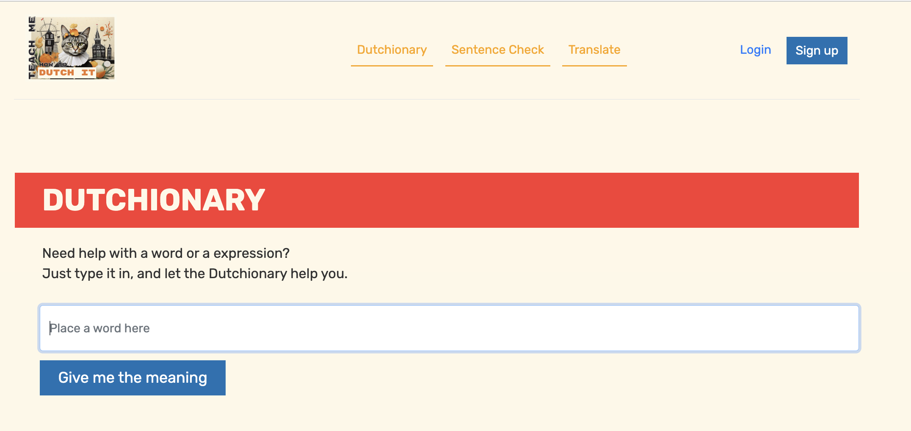

# CS50 Web — Web Programming with Python and JavaScript (Solutions)

Course: CS50’s Web Programming with Python and JavaScript  
Official course page: https://cs50.harvard.edu/web/  
Walkthrough playlist (my demos): https://www.youtube.com/playlist?list=PLNDDAVxjlPk3-h1MiH-fZLVEiiawkmplP

> Academic honesty: If you are currently taking CS50 Web, follow CS50’s Academic Honesty policy and do not submit these solutions as your own.

## Repo structure (this folder)

- Each **project** has its own folder with code + notes.
- I keep a **week-by-week index** here so you can quickly jump to the relevant work.

## Week-by-week index

| Week | Topic | Course materials | 
|---:|---|---|
| 0 | HTML, CSS | https://cs50.harvard.edu/web/weeks/0/ |
| 1 | Git | https://cs50.harvard.edu/web/weeks/1/ |
| 2 | Python | https://cs50.harvard.edu/web/weeks/2/ |
| 3 | Django | https://cs50.harvard.edu/web/weeks/3/ | 
| 4 | SQL, Models, Migrations | https://cs50.harvard.edu/web/weeks/4/ | 
| 5 | JavaScript | https://cs50.harvard.edu/web/weeks/5/ |
| 6 | User Interfaces | https://cs50.harvard.edu/web/weeks/6/ | 
| 7 | Testing, CI/CD | https://cs50.harvard.edu/web/weeks/7/ |
| 8 | Scalability & Security | https://cs50.harvard.edu/web/weeks/8/ |

## Projects (specs + quick links)

- [Project 0 — Search (front-end for Google Search)](./project_00_search/): [Video Walkthrough](https://www.youtube.com/watch?v=NGbfzpczgQM)
- [Project 1 — Wiki (Wikipedia-like encyclopedia)](./project_01_wiki/):  [Video Walkthrough](https://www.youtube.com/watch?v=BlAb6fRBwis&)
- [Project 2 — Commerce (eBay-like auctions)](./project_02_commerce/): [Video Walkthrough](https://www.youtube.com/watch?v=IKhq8ICpgIA) | [Long version](https://www.youtube.com/watch?v=5l0fsvA6xj8)
- [Project 3 — Mail (email client using API calls)](./project_03_mail/): [Video Walkthrough](https://www.youtube.com/watch?v=XRNRcemLPmA)
- [Project 4 — Network (social network)](./project_04_network/): [Video Walkthrough](https://www.youtube.com/watch?v=SzLPYVABpl0)
- [Final Project — Capstone](https://teachmehowtodutch.com/): [Video Walkthrough](https://www.youtube.com/watch?v=0YSrAEEi6-0)

## How to run (typical Django projects)

Most projects are Django apps. Common commands (may vary per project):

1. Create/activate a virtual environment
2. Install deps (if you have requirements.txt): `pip install -r requirements.txt`
3. Run migrations: `python manage.py makemigrations` then `python manage.py migrate`
4. Start server: `python manage.py runserver`
