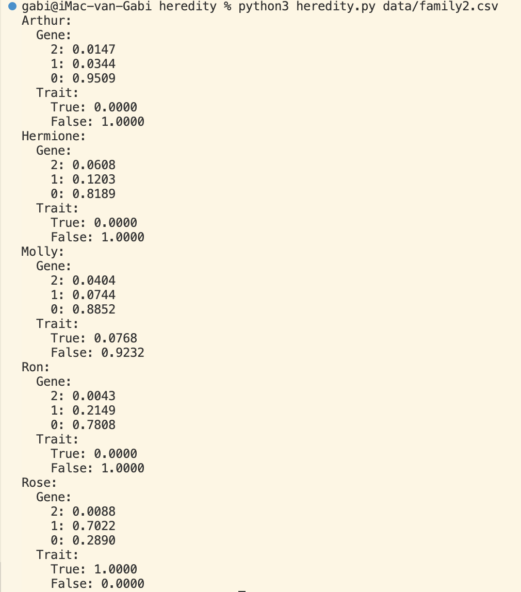

# My CS50 Repository
This repository is a personal space for consulting notes and projects created during Harvard CS50 courses.

>  ⚠️  **If you are consulting these as a CS50 student, keep in mind [Harvard's Academy Honesty Policy](https://cs50.harvard.edu/ai/2020/honesty/)**

---
## 👩‍💻 [ CS50P ] PYTHON 
https://cs50.harvard.edu/python/2022/
(Completed in July 2023)

**FINAL PROJECT:** [Dutchionary](https://imgabi.com/dutchionary) is a Flask web application powered by OpenAI API. 
I submitted a simple application running in the terminal for the final assignment.

----

## 👩‍💻 [ CS50AI ] INTRODUCTION TO ARTIFICIAL INTELLIGENCE
https://cs50.harvard.edu/ai/2020/
(Currently enrolled)

### Week 00: SEARCH

**Topics covered:** Depth-first search, breadth-first search, uninformed search, informed search, greedy best-first search, A* search, adversarial search, minimax, alpha-beta pruning, depth-limited minimax

**PROJECT 01: DEGREES**
Write a program determining how many “degrees of separation” apart two actors are.

**PROJECT 02: TIC-TAC-TOE**
Implement an AI to play Tic-Tac-Toe optimally (Minimax).

----
### Week 01: KNOWLEDGE

**Topics covered:** Propositional logic, inference algorithms, de Morgan’s law, distributive property, inference by resolution

**PROJECT 01: KNIGHTS**
Write a program to solve logic puzzles.

**PROJECT 02: MINESWEEPER**
Write an AI to play Minesweeper (Propositional logic, knowledge representation).

----
### Week 02: UNCERTAINTY

**Topics covered:** Propositional logic, inference algorithms, Bayes' rule, de Morgan’s law, distributive property, inference by resolution

**PROJECT 01: PAGERANK**
Write an AI to rank web pages by importance (Markov Chain).

**PROJECT 02: HEREDITY**
Write an AI to assess the likelihood of a person having a particular genetic trait (Bayesian network).

----

### Week 03: OPTIMISATION

**Topics covered:**  Problem formulation (local search, linear programming algorithms, constraint satisfaction), hill climbing (and variants), simulated annealing, backtracking search, inference

**PROJECT 01: CROSSWORD**
Write an AI to generate crossword puzzles (backtrack search).

----

### Week 04: LEARNING

**Topics covered:**  Supervised learning, reinforcement learning (Markov chain, Q-learning, greedy decision making),  unsupervised learning (clustering) | **Libraries: SkLearn**

**PROJECT 01: SHOPPING**
Write an AI to predict whether online shopping customers will complete a purchase (K-neighbours classifier). **Using sklearn**. 

**PROJECT 02: NIM**
Write an AI that teaches itself to play Nim through reinforcement learning.

----

### Week 05: NEURAL NETWORKS

**Topics covered:**  Gradient descent (stochastic, mini-batch), deep neural networks, computer vision (image convolution, pooling)  **Libraries: TensorFlow, MatPlotLib**

**PROJECT 01: TRAFFIC**
Write an AI to identify which traffic sign appears in a photograph, **using TensorFlow**.

----

### Week 06: LANGUAGES

**Topics covered:**  Natural language processing, semantics x syntax, n-grams, tokenisation, Markov models, text categorisation, information retrieval, topic modelling | **Libraries: Nltk** 

**PROJECT 01: PARSER**
Write an AI to parse sentences and extract noun phrases.

**PROJECT 02: QUESTIONS**
Write an AI to ask questions (information retrieval based on a corpus). 

